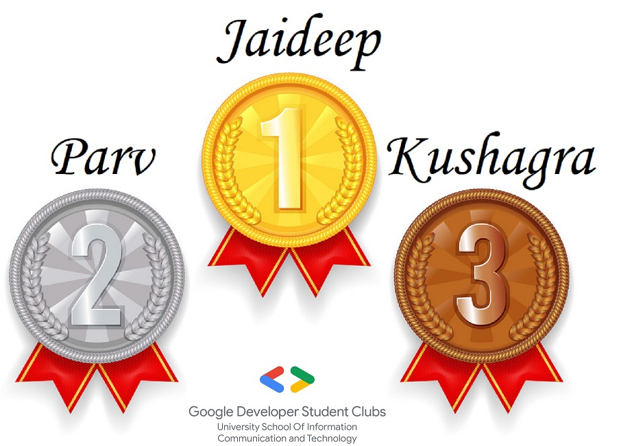

 ## ***<_CodeNite_/> - Game of Code***

#Winners

#Solutions
   - [Angry Professor](./A_Angry_Professor_at_USICT.cpp)
   - [Unique Couples](./B_Unique_Couples.cpp)
   - [Odd Even Even Odd](./C_Odd_Even_Even_Odd.cpp)
   - [Bar Pattern](./D_Bar_Pattern.cpp)
   - [Money double in 21 days ?](./E_Money_double_in_21_days_.cpp)
   - [Range Sum](./F_Range_Sum.cpp)

#Links
 - [Contest Link](https://codeforces.com/contestInvitation/619ef800b4629f4d2e7b687b076a78eea55e552b)
 - [Upsolving Session](https://www.youtube.com/watch?v=csVelNP7y54)
 - [Upsolving Session PDF](./Resources/Upsolving%20Session%20pdf.pdf)

#Credits

   
<strong>Poster</strong>

    
   - [Rahul Gandhi](https://github.com/RGTechno/)
   - [Sarthak Khandelwal](https://github.com/HellVolhard07)
  

   
<strong>Upsolving Session</strong>

    
   - [Dhruv Pasricha](https://github.com/DhruvPasricha)
  

<strong>Prepared By</strong>

    
   - [Dhruv Pasricha](https://github.com/DhruvPasricha)
  
   - [Tushar Khanduri](https://github.com/Tushar-K24)

   
<strong>Writers</strong>

    
   - [Dhruv Pasricha](https://github.com/DhruvPasricha)
  
   - [Tushar Khanduri](https://github.com/Tushar-K24)

